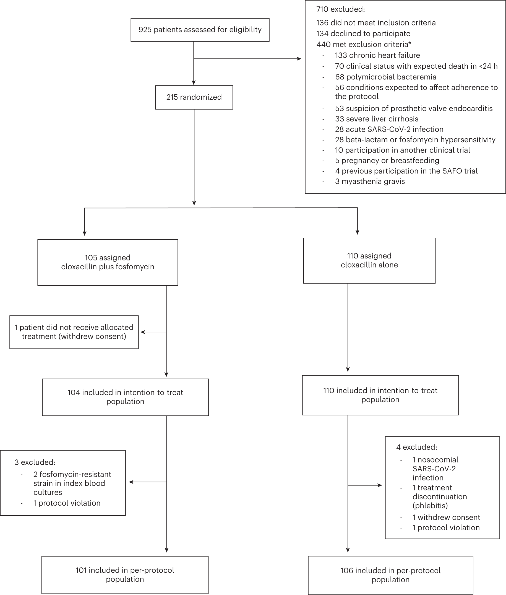
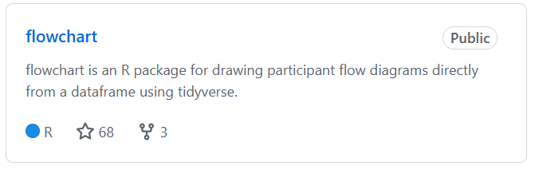
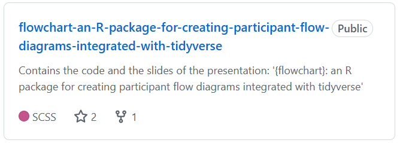

# Index {background-color="lightgrey"}

**1.** Introduction

**2.** The {flowchart} package

**3.** Hands-on examples

**4.** Conclusions

# Introduction {background-color="lightgrey"}

## Flowcharts

- In any study, a participant flowchart serves as a visual representation of the steps and decisions in the study workflow.

- Usually different decisions are made from the initial cohort of eligible or screened subjects until a final number of these subjects are considered to be included in the analyses.

- It is essential that the steps and numbers are clearly defined and that the process is transparent in order to ensure the reproducibility of the study and the quality of the reporting.

- In clinical research, the CONSORT, STROBE and ICH guidelines strongly recommend the use of flowcharts.

## Flowchart creation 

- The creation of flowcharts are time-consuming and labor-intensive, as every screened or recruited subject must be included, without exception.

- Usually this process must be repeated many times until the database is closed for analysis. 

- There are several R packages dedicated to building flowcharts: {Gmisc}, {DiagrammeR}, {consort}, {ggflowchart}.

- Some involve complex programming and manual parameterization and others are designed for building other kind of diagrams. 

# The {flowchart} package {background-color="lightgrey"}

## {flowchart} 

:::: {.columns}

::: {.column width="30%"}

{fig-align="center"}
:::

::: {.column width="5%"}

<hr style="width:2px; height:370px; background-color:#E0B046; border:none; margin-top: 30% !important; margin:0 auto; " />

:::

::: {.column width="65%"}

- It produces flowcharts that automatically adapt to the study database, ensuring reproducibility.

- It follows the tidyverse philosophy: from the study database we have to define a set of simple operations combined with the pipe operator (`|>` or `%>%`).

- These functions are highly customizable allowing manual parameters to be entered if necessary.

:::

::::

<br>

Published in CRAN since February 2024:

<center>
[](https://cran.r-project.org/web/packages/flowchart/index.html)&#160;&#160;
[](https://app.codecov.io/gh/bruigtp/flowchart?branch=main)&#160;&#160;
[](https://cran.r-project.org/package=flowchart)&#160;&#160;
[](https://cran.r-project.org/package=flowchart)
</center>

## {flowchart}

<center>
{width="70%"}

Alexander Calder (1898-1976)

</center>

## Overview of the package

<br>

::: columns
::: {.column width="50%"}
-   Create a flowchart:

    -   `as_fc()`

    -   `fc_draw()`

    -   `fc_split()`

    -   `fc_filter()`
    
:::

::: {.column width="50%"}
-   Combine flowcharts:

    -   `fc_merge()`

    -   `fc_stack()`

:::
:::

::: columns
::: {.column width="50%"}
-   Customize flowcharts:
    
    -   `fc_modify()`
    -   `fc_theme()`
    
:::

::: {.column width="50%"}
-   Export flowcharts:
    
    -   `fc_export()`

:::
:::

## `safo` dataset

-   It's the built-in dataset of the package.

-   Randomly generated dataset from the SAFO clinical trial[^1].

[^1]: Grillo, S., Pujol, M., Miró, J.M. et al. Cloxacillin plus fosfomycin versus cloxacillin alone for methicillin-susceptible <i>Staphylococcus aureus</i> bacteremia: a randomized trial. Nat Med 29, 2518--2525 (2023)

```{r echo=FALSE}
library(flowchart)
library(tidyverse)
head(safo[, c("id", "inclusion_crit", "exclusion_crit", "decline_part", "group", "itt", "pp")]) |> 
  gt::gt() |> 
  gt::cols_align("center")
```

# How to create a flowchart {background-color="lightgrey"}

## `as_fc()` 

-   Allows to initialize a dataset in the class `fc` created for this package.

-   Creates a flowchart with an initial box showing the total number of rows of the dataset.

```{r echo=TRUE}
library(flowchart)

safo_fc <- safo |> 
  as_fc()
```

## `as_fc()` {auto-animate="true"}

-   Allows to initialize a dataset in the class `fc` created for this package.

-   Creates a flowchart with an initial box showing the total number of rows of the dataset.

```{r echo=TRUE}
library(flowchart)

safo_fc <- safo |> 
  as_fc()

str(safo_fc, max.level = 1)
```


## `as_fc()` {auto-animate="true"}

::: {style="position: absolute; left: 50%; top: 50%;-webkit-transform: translate(-50%, -50%); transform: translate(-50%, -50%);"}

`safo_fc$fc`

```{r echo=FALSE}
safo_fc$fc |> 
  gt::gt() |> 
  gt::tab_options(
    table.font.size = "small"   # or "x-small", "80%", etc.
    # heading.padding.horizontal = gt::px(2)     # reduce cell padding
  )
```

:::

## `fc_draw()`

-   Allows to draw a previously created `fc` object:

```{r echo=TRUE, eval=FALSE}
safo |> 
  as_fc()
```

## `fc_draw()` {auto-animate="true"}

-   Allows to draw a previously created `fc` object:

```{r echo=TRUE, fig.width = 5, fig.height = 2, fig.align = "center"}
safo |> 
  as_fc() |> 
  fc_draw()
```

## `fc_draw()` {auto-animate="true"}

-   Allows to draw a previously created `fc` object:

```{r echo=TRUE, fig.width = 5, fig.height = 2, fig.align = "center"}
#| classes: custom2
safo |> 
  as_fc(label = "Patients assessed for eligibility") |> 
  fc_draw()
```

::: {style="margin-top: -10%;"}

-   We can use the `label` argument to modify the box label.

:::

## `fc_filter()` 

-   We can filter an existing flowchart specifying the logic in which the filter is to be applied:

```{r echo=TRUE, fig.width = 3, fig.height = 2, out.width = "600"}
#| classes: custom2
#| output-location: "column"
safo |> 
  as_fc(label = "Patients assessed for eligibility") |> 
  fc_draw()
```

## `fc_filter()` {auto-animate="true"}

-   We can filter an existing flowchart specifying the logic in which the filter is to be applied:

```{r echo=TRUE, fig.width = 3, fig.height = 3, out.width = "600"}
#| classes: custom
#| output-location: "column"
safo |> 
  as_fc(label = "Patients assessed for eligibility") |>
  fc_filter(!is.na(group)) |> 
  fc_draw()
```

## `fc_filter()` {auto-animate="true"}

-   We can filter an existing flowchart specifying the logic in which the filter is to be applied:

```{r echo=TRUE, fig.width = 3, fig.height = 3, out.width = "600"}
#| classes: custom
#| output-location: "column"
safo |> 
  as_fc(label = "Patients assessed for eligibility") |>
  fc_filter(!is.na(group), label = "Randomized") |> 
  fc_draw()
```

::: {style="margin-top: -15%;"}
-   We can change again the `label`.
:::

## `fc_filter()` {auto-animate="true"}

-   We can filter an existing flowchart specifying the logic in which the filter is to be applied:

```{r echo=TRUE, fig.width = 4, fig.height = 4, out.width = "800"}
#| classes: custom
#| output-location: "column"
safo |> 
  as_fc(label = "Patients assessed for eligibility") |>
  fc_filter(!is.na(group), label = "Randomized", show_exc = TRUE) |> 
  fc_draw()
```

::: {style="margin-top: -15%;"}
-   We can change again the `label`.

-   We can use `show_exc=TRUE` to show the excluded rows.
:::

## `fc_split()` 

-   We can split an existing flowchart according to the different values of a column:

```{r echo=TRUE, fig.width = 4, fig.height = 4, out.width = "800"}
#| classes: custom
#| output-location: "column"
safo |> 
  as_fc(label = "Patients assessed for eligibility") |>
  fc_filter(!is.na(group), label = "Randomized", show_exc = TRUE) |> 
  fc_draw()
```

## `fc_split()` {auto-animate="true"}

-   We can split an existing flowchart according to the different values of a column:

```{r echo=TRUE, fig.width = 4, fig.height = 5, out.width = "600"}
#| classes: custom
#| output-location: "column"
safo |> 
  as_fc(label = "Patients assessed for eligibility") |>
  fc_filter(!is.na(group), label = "Randomized", show_exc = TRUE) |> 
  fc_split(group) |> 
  fc_draw()
```

# Customize a flowchart {background-color="lightgrey"}

## Modify function arguments {auto-animate=true}

- We can customize the flowchart either with the arguments provided by each function: `as_fc()`, `fc_filter()` and `fc_split()`.

::: {style="font-size: 25px;"}

<table>
<tbody>
  <tr>
   <td style="text-align:left;"> `label=` </td>
   <td style="text-align:left;"> modify the label. </td>
  </tr>
  <tr>
   <td style="text-align:left;"> `text_pattern=` </td>
   <td style="text-align:left;"> modify the pattern of the text (e.g. `{label}\n {n} ({perc}%)`. </td>
  </tr>
   <tr>
   <td style="text-align:left;"> `round_digits=` </td>
   <td style="text-align:left;"> number of digits to round percentages (default is 2)
   </td>
  </tr>
  <tr>
   <td style="text-align:left;"> `text_color=` </td>
   <td style="text-align:left;"> modify the color of the text. </td>
  </tr>
  <tr>
   <td style="text-align:left;"> `text_fs=` </td>
   <td style="text-align:left;"> modify the font size of the text. </td>
  </tr>
  <tr>
   <td style="text-align:left;"> `bg_fill=` </td>
   <td style="text-align:left;"> modify the background color of the box. </td>
  </tr>
</tbody>
</table>

:::

<center>...</center> 

-   We can use the `fc_theme()` function to modify at once all arguments for all boxes.

# Export flowcharts {background-color="lightgrey"}

## `fc_export()` {auto-animate="true"}

- We can export the drawn flowchart to some of the most popular graphic devices.

- These include both bitmap (`png`, `jpeg`, `tiff`, `bmp`) and vector (`svg`, `pdf`) formats.

```{r echo= TRUE, eval = FALSE}
safo |> 
  as_fc(label = "Patients assessed for eligibility") |>
  fc_filter(!is.na(group), label = "Randomized", show_exc = TRUE) |> 
  fc_draw() 
```

## `fc_export()` {auto-animate="true"}

- We can export the drawn flowchart to some of the most popular graphic devices.

- These include both bitmap (`png`, `jpeg`, `tiff`, `bmp`) and vector (`svg`, `pdf`) formats.

```{r echo=TRUE, eval = FALSE}
safo |> 
  as_fc(label = "Patients assessed for eligibility") |>
  fc_filter(!is.na(group), label = "Randomized", show_exc = TRUE) |> 
  fc_draw() |> 
  fc_export("flowchart.png")
```

## `fc_export()` {auto-animate="true"}

- We can export the drawn flowchart to some of the most popular graphic devices.

- These include both bitmap (`png`, `jpeg`, `tiff`, `bmp`) and vector (`svg`, `pdf`) formats.

```{r echo=TRUE, eval = FALSE}
safo |> 
  as_fc(label = "Patients assessed for eligibility") |>
  fc_filter(!is.na(group), label = "Randomized", show_exc = TRUE) |> 
  fc_draw() |> 
  fc_export("flowchart.png", width = 3000, height = 4000, res = 700)
```

- We can customize the size and resolution of the image to save.

# Hands-on examples {background-color="lightgrey"}

## Example 1 {auto-animate="true"}

-   We will try to build a flowchart for the complete participant flow of the SAFO study trial:

## Example 1 {auto-animate="true"}

```{r echo=TRUE, fig.width = 4, fig.height = 4, out.width = "600"}
#| classes: custom
#| output-location: "column"
safo |> 
  as_fc(label = "Patients assessed for eligibility") |>
  fc_draw()
```

## Example 1 {auto-animate="true"}

```{r echo=TRUE, fig.width = 4, fig.height = 4, out.width = "600"}
#| classes: custom
#| output-location: "column"
safo |> 
  as_fc(label = "Patients assessed for eligibility") |>
  fc_filter(!is.na(group), label = "Randomized", show_exc = TRUE) |> 
  fc_draw()
```

## Example 1 {auto-animate="true"}

```{r echo=TRUE, fig.width = 4, fig.height = 5, out.width = "600"}
#| classes: custom
#| output-location: "column"
safo |> 
  as_fc(label = "Patients assessed for eligibility") |>
  fc_filter(!is.na(group), label = "Randomized", show_exc = TRUE) |> 
  fc_split(group) |> 
  fc_draw()
```

## Example 1 {auto-animate="true"}

```{r echo=TRUE, fig.width = 4, fig.height = 7, out.width = "450"}
#| classes: custom
#| output-location: "column"
safo |> 
  as_fc(label = "Patients assessed for eligibility") |>
  fc_filter(!is.na(group), label = "Randomized", show_exc = TRUE) |> 
  fc_split(group) |> 
  fc_filter(itt == "Yes", label = "Included in ITT") |> 
  fc_draw()
```

## Example 1 {auto-animate="true"}

```{r echo=TRUE, fig.width = 4, fig.height = 7, out.width = "450"}
#| classes: custom4
#| output-location: "column"
safo |> 
  as_fc(label = "Patients assessed for eligibility") |>
  fc_filter(!is.na(group), label = "Randomized", show_exc = TRUE) |> 
  fc_split(group) |> 
  fc_filter(itt == "Yes", label = "Included in ITT") |> 
  fc_filter(pp == "Yes", label = "Included in PP") |> 
  fc_draw()
```

## Example 1

<center>
{width="40%"}
</center>

<center><small> Grillo, S., Pujol, M., Miró, J.M. et al. Cloxacillin plus fosfomycin versus cloxacillin alone for methicillin-susceptible <i>Staphylococcus aureus</i> bacteremia: a randomized trial. Nat Med 29, 2518--2525 (2023). <href>https://doi.org/10.1038/s41591-023-02569-0</href> </small></center>

## Example 2 {auto-animate="true"}

-   Now, we will create a flowchart without any dataset using the `N=` argument:

## Example 2 {auto-animate="true"}

```{r echo=TRUE, fig.width = 3, fig.height = 3, out.width = "800"}
#| classes: custom
#| output-location: "column"
as_fc(N = 300, label = "Available patients") |> 
  fc_draw()
```

## Example 2 {auto-animate="true"}

```{r echo=TRUE, fig.width = 4, fig.height = 4, out.width = "800"}
#| classes: custom
#| output-location: "column"
as_fc(N = 300, label = "Available patients") |>
  fc_filter(N = 240, label = "Randomized patients", show_exc = TRUE) |> 
  fc_draw()
```

## Example 2 {auto-animate="true"}

```{r echo=TRUE, fig.width = 4, fig.height = 5, out.width = "600"}
#| classes: custom
#| output-location: "column"
as_fc(N = 300, label = "Available patients") |>
  fc_filter(N = 240, label = "Randomized patients", show_exc = TRUE) |> 
  fc_split(N = c(100, 80, 60), label = c("Group A", "Group B", "Group C")) |>
  fc_draw()
```

## Example 2 {auto-animate="true"}

```{r echo=TRUE, fig.width = 4, fig.height = 5.5, out.width = "600"}
#| classes: custom5
#| output-location: "column"
as_fc(N = 300, label = "Available patients") |>
  fc_filter(N = 240, label = "Randomized patients", show_exc = TRUE) |> 
  fc_split(N = c(100, 80, 60), label = c("Group A", "Group B", "Group C")) |>
  fc_filter(N = c(80, 75, 50), label = "Finished the study") |> 
  fc_draw()
```

# Conclusions {background-color="lightgrey"}

## Conclusions

::: {style="font-size: 35px"}
-   A clear and detailed reporting of the flow of participants in health research studies is required and recommended.

-   With this package, flowchart programming in R is made easier and accessible within the tidyverse workflow.

-   Flowchart reproducibility is assured.

-   As a limitation, we have not considered all possible scenarios and study designs, although is highly customizable.

:::

## Code repository

<br><br>
<center>
`r fontawesome::fa("github")` [github.com/bruigtp](https://github.com/bruigtp/)
</center>

<br>

::: columns
::: {.column width="50%"}
<center>

</center>
:::
::: {.column width="50%"}
<center>

</center>
:::
:::

# Thank you! {.thankyou}

<br>

<center>

Website:

{width="30%"}

`r fontawesome::fa("globe")` <a href="https://bruigtp.github.io/flowchart/" style = "color: #E0B046; font-weight: bold;">bruigtp.github.io/flowchart</a>

</center>